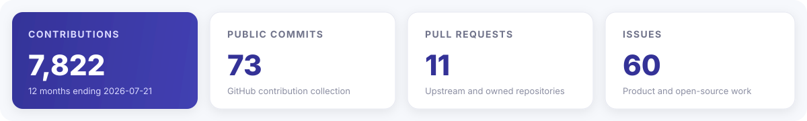

  

  
  
  

## I turn rules into working systems

I am **Sergio**, a **Washington State CPA**, three-time AI hackathon award winner, and product builder specializing in public grants and government-funded R&D. I build at the boundary between accounting judgment and software execution:

- **public-grant operations**, post-award closeout, evidence review, and recovery workflows;
- **agent infrastructure**, source-bound execution, orchestration, and developer tools;
- **open source**, with upstream work in Ouroboros, K-Skill, ContractPlane, and Paperthin.

My recurring question is simple:

> How do we turn professional rules into systems that remain inspectable, testable, and safe to act on?

## Recognition

- **Open Builders Alliance Weekendthon**, runner-up with SealCPA and recipient of an **OpenAI-backed USD 10,000 prize**
- **Build Together Hackathon**, winner
- **Microsoft Copilot Hackathon**, award recipient
- **Ouroboros ecosystem**, open-source maintainer and upstream contributor

  

## Open-source work

<table>
  <tr>
    <td width="50%" valign="top">
      <h3><a href="https://github.com/Q00/ouroboros">Q00/ouroboros</a></h3>
      
<strong>Upstream contributor</strong> to the specification-first Agent OS.

      <ul>
        <li><a href="https://github.com/Q00/ouroboros/pull/1387">#1387</a> Codex stream timeout overrides</li>
        <li><a href="https://github.com/Q00/ouroboros/pull/1640">#1640</a> per-phase interview timings</li>
        <li><a href="https://github.com/Q00/ouroboros/pull/1661">#1661</a> proposal-first onboarding contract</li>
      </ul>
    </td>
    <td width="50%" valign="top">
      <h3><a href="https://github.com/Ouro-labs">Ouro-labs</a></h3>
      
<strong>Maintainer</strong> across the Ouroboros product ecosystem.

      <ul>
        <li><a href="https://github.com/Ouro-labs/ourocode">ourocode</a>, native CLI and MCP orchestration</li>
        <li><a href="https://github.com/Ouro-labs/ouroboros-plugins">ouroboros-plugins</a>, plugin ecosystem</li>
        <li><a href="https://github.com/Ouro-labs/ouroboros-site">ouroboros-site</a>, public product site</li>
      </ul>
    </td>
  </tr>
  <tr>
    <td width="50%" valign="top">
      <h3><a href="https://github.com/NomaDamas/k-skill">NomaDamas/k-skill</a></h3>
      
Contributed a Korean business due-diligence skill suite.

      <ul>
        <li><a href="https://github.com/NomaDamas/k-skill/pull/317">#317</a> five atomic skills, one combined skill, and proxy routes</li>
        <li>2,802 additions across 30 files</li>
      </ul>
    </td>
    <td width="50%" valign="top">
      <h3><a href="https://github.com/LilMGenius/paperthin">LilMGenius/paperthin</a></h3>
      
Authored five upstream proposals for validation, link integrity, multi-perspective review, and intent-first agent behavior.

      <ul>
        <li><a href="https://github.com/LilMGenius/paperthin/pull/12">#12</a> SKILL.md structure and frontmatter validation</li>
        <li><a href="https://github.com/LilMGenius/paperthin/pull/13">#13</a> skill-reference integrity checks</li>
        <li><a href="https://github.com/LilMGenius/paperthin/pull/14">#14</a> relative-link verification</li>
        <li><a href="https://github.com/LilMGenius/paperthin/pull/15">#15</a> independent perspective panel</li>
        <li><a href="https://github.com/LilMGenius/paperthin/pull/16">#16</a> proposal-first intent inference</li>
      </ul>
    </td>
  </tr>
</table>

Also contributed the <a href="https://github.com/Q00/contractplane/pull/13">OpenAI-family evaluation arm to Q00/contractplane</a>.

## Products and public systems

<table>
  <tr>
    <td width="50%" valign="top">
      <h3><a href="https://grantback.vercel.app">GrantBack</a></h3>
      
A source-bound obligation compiler that turns fragmented post-award evidence into a candidate receivable package for accountant review.

      
<code>GPT-5.6</code> <code>Codex</code> <code>TypeScript</code> <code>MCP</code> <code>Apps SDK</code>

    </td>
    <td width="50%" valign="top">
      <h3><a href="https://github.com/sergiobuilds/grant-radar-public">Grant Radar</a></h3>
      
Collects Korean public-funding opportunities from multiple sources and exposes them through search and MCP tools.

      
<code>TypeScript</code> <code>Public data</code> <code>MCP</code>

    </td>
  </tr>
  <tr>
    <td width="50%" valign="top">
      <h3><a href="https://github.com/sergiobuilds/biz-health-check">Business Health Check</a></h3>
      
Cross-checks official Korean datasets for business status, pension records, sanctions, and corporate facts without adding unsupported interpretation.

      
<code>Python</code> <code>Government APIs</code> <code>Evidence</code>

    </td>
    <td width="50%" valign="top">
      <h3><a href="https://github.com/sergiobuilds/tensei-slime">Tensei Slime</a></h3>
      
A project-coherence system for coding agents built around MasterMap, Chronicle, Four Drawers, and Gatekeeper.

      
<code>Shell</code> <code>Agent workflows</code> <code>Project memory</code>

    </td>
  </tr>
  <tr>
    <td width="50%" valign="top">
      <h3><a href="https://github.com/sergiobuilds/rightseat">RightSeat</a></h3>
      
A visible AI operator that sits beside terminal AI workers.

      
<code>Python</code> <code>Agent UX</code>

    </td>
    <td width="50%" valign="top">
      <h3><a href="https://github.com/sergiobuilds/ux-workflow-check">UX Workflow Check</a></h3>
      
An intent-first skill for finding the user need that a specification failed to write down.

      
<code>Claude</code> <code>Codex</code> <code>Gemini</code> <code>Grok</code>

    </td>
  </tr>
</table>

## Working stack

  
  
  
  
  
  
  
  

## Contribution trail

  <picture>
    <source media="(prefers-color-scheme: dark)" srcset="https://raw.githubusercontent.com/sergiobuilds/sergiobuilds/output/github-contribution-grid-snake-dark.svg" />
    <source media="(prefers-color-scheme: light)" srcset="https://raw.githubusercontent.com/sergiobuilds/sergiobuilds/output/github-contribution-grid-snake.svg" />
    
  </picture>

  <a href="https://ouroboros.page/">Ouroboros</a> ·
  <a href="https://grantback.vercel.app">GrantBack</a> ·
  <a href="https://github.com/sergiobuilds?tab=repositories">Repositories</a>

