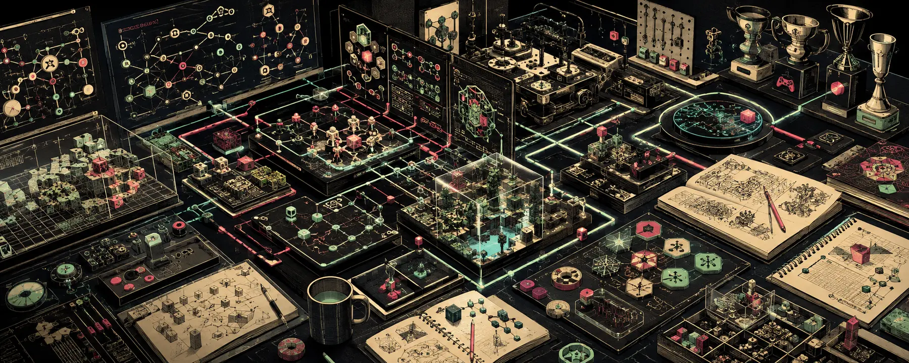

  

# Sergio

### Agent-native software. Open-source systems. Games built differently.

  
  
  

  
  
  
  

<a href="#open-source-work">Open source</a> · <a href="#systems-in-motion">Systems in motion</a> · <a href="#recognition">Recognition</a> · <a href="https://github.com/sergiobuilds?tab=repositories">All repositories</a>

---

I build the machinery behind autonomous creation: systems that help agents plan, make, test, and improve real software. Right now that means open game-development infrastructure, agent harnesses, and experiments that ship fast enough to teach the next one.

> 🟦 **CURRENT SIGNAL** &nbsp; [BidPilot](https://github.com/sergiobuilds/bidpilot) is a **Global Top 12 finalist** in the [Snowflake CoCo CLI Hackathon 2026](https://hack2skill.com/event/cococlihack/). Final result pending.

## Open-source work

<table>
<tr>
<td width="50%" valign="top">
  
<a href="https://github.com/DaedalGames"><b>Daedal Games</b></a> Member · agent-native game development

Building an open ecosystem for games made, tested, and improved by agents.

<ul>
<li><a href="https://github.com/DaedalGames/OpenGame"><b>OpenGame</b></a> · open agentic coding for games</li>
<li><a href="https://github.com/DaedalGames/godogen"><b>godogen</b></a> · autonomous Godot, Bevy, and Babylon.js development</li>
<li><a href="https://github.com/DaedalGames/HarnessOfHarness"><b>HarnessOfHarness</b></a> · continual-improvement infrastructure</li>
</ul>
</td>
<td width="50%" valign="top">
  
<a href="https://github.com/LilMGenius/paperthin"><b>LilMGenius/paperthin</b></a> Agent behavior that holds up under pressure

Authored five proposals spanning validation, link integrity, independent review, and intent-first behavior.

<ul>
<li><a href="https://github.com/LilMGenius/paperthin/pull/12">#12</a> SKILL.md structure and frontmatter validation</li>
<li><a href="https://github.com/LilMGenius/paperthin/pull/13">#13</a> skill-reference integrity checks</li>
<li><a href="https://github.com/LilMGenius/paperthin/pull/14">#14</a> relative-link verification</li>
<li><a href="https://github.com/LilMGenius/paperthin/pull/15">#15</a> independent perspective panel</li>
<li><a href="https://github.com/LilMGenius/paperthin/pull/16">#16</a> proposal-first intent inference</li>
</ul>
</td>
</tr>
<tr>
<td width="50%" valign="top">
  
<a href="https://github.com/Q00/ouroboros"><b>Q00/ouroboros</b></a> The specification-first Agent OS
<ul>
<li><a href="https://github.com/Q00/ouroboros/pull/1387">#1387</a> Codex stream timeout overrides · merged</li>
<li><a href="https://github.com/Q00/ouroboros/pull/1640">#1640</a> per-phase interview timings · merged</li>
<li><a href="https://github.com/Q00/ouroboros/pull/1661">#1661</a> proposal-first onboarding · experiment</li>
</ul>
</td>
<td width="50%" valign="top">
  
<a href="https://github.com/Ouro-labs"><b>Ouro-labs</b></a> Open infrastructure for serious agent work
<ul>
<li><a href="https://github.com/Ouro-labs/ourocode"><b>ourocode</b></a> · native CLI and MCP orchestration</li>
<li><a href="https://github.com/Ouro-labs/ouroboros-plugins"><b>ouroboros-plugins</b></a> · plugin ecosystem</li>
<li><a href="https://github.com/Ouro-labs/ouroboros-site"><b>ouroboros-site</b></a> · <a href="https://ouroboros.page/">ouroboros.page</a></li>
</ul>
</td>
</tr>
</table>

Also merged: [Q00/contractplane #13](https://github.com/Q00/contractplane/pull/13), adding an OpenAI-family evaluation arm.

---

## Systems in motion

<table>
<tr>
<td colspan="2" valign="top">
  
<a href="https://github.com/sergiobuilds/bidpilot"><b>BidPilot</b></a>

An evidence-aware pursuit agent that turns a tender and supplier profile into a decision, win position, proposal, and owned next steps.

</td>
</tr>
<tr>
<td width="50%" valign="top">
<a href="https://github.com/sergiobuilds/tensei-slime"><b>Tensei Slime</b></a> Project coherence for coding agents

MasterMap, Chronicle, Four Drawers, and Gatekeeper keep long-running agent work from losing the plot.

</td>
<td width="50%" valign="top">
<a href="https://github.com/sergiobuilds/flashpatch"><b>Flashpatch</b></a> Fail-closed visual QA for games

Turns visual correctness into evidence instead of a confident guess.

</td>
</tr>
<tr>
<td width="50%" valign="top">
<a href="https://github.com/sergiobuilds/polysona"><b>Polysona</b></a> Multi-perspective agent orchestration

A metacognition-driven persona layer for extracting genuinely different perspectives.

</td>
<td width="50%" valign="top">
<a href="https://github.com/sergiobuilds/rightseat"><b>RightSeat</b></a> A visible operator beside terminal AI

Keeps autonomous workers observable without dragging the operator back into every step.

</td>
</tr>
</table>

<b>Earlier systems:</b> <a href="https://grantback.vercel.app">GrantBack</a> · <a href="https://github.com/sergiobuilds/grant-radar-public">Grant Radar</a> · <a href="https://github.com/sergiobuilds/biz-health-check">Business Health Check</a> · <a href="https://github.com/sergiobuilds/ux-workflow-check">UX Workflow Check</a>

---

## Recognition

| Event | Result |
| :--- | :--- |
| [Snowflake CoCo CLI Hackathon 2026](https://hack2skill.com/event/cococlihack/) | **Global Top 12 finalist** · final result pending |
| [Open Builders Alliance Weekendthon](https://www.oba.run/) | **Runner-up** with SealCPA · OpenAI-backed **USD 10,000 prize** |
| KORAIL × Incheon International Airport Corporation AI Hackathon | **Honorable Mention** |
| Build Together Hackathon | **Excellence Award** · runner-up |
| Microsoft Copilot Hackathon | **Award recipient** |

---

### Build it. Open it. Let it learn.

<a href="https://github.com/DaedalGames">Daedal Games</a> · <a href="https://ouroboros.page/">Ouroboros</a> · <a href="https://github.com/sergiobuilds?tab=repositories">All repositories</a>

